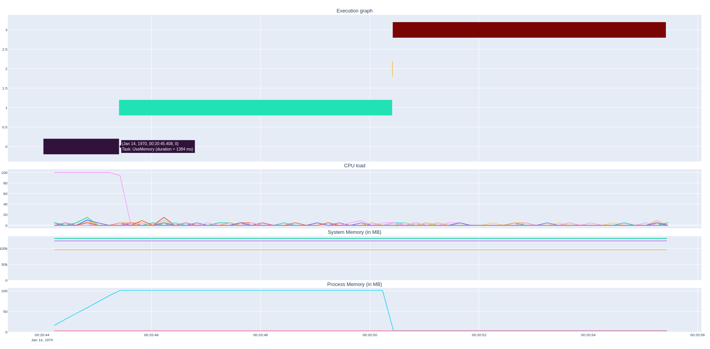

# cppuprofile


[](https://orange-opensource.github.io/cppuprofile/)


This project provides a tiny C++ profiling library for monitoring:
* execution time
* CPU(s) usage
* memory usage
* GPU(s) usage and memory

This library aims at collecting metrics on embedded devices to monitor device
performance while operating heavy tasks or booting for example. Those metrics can
be useful to check that load is properly spread onto all CPU cores or
that memory is not starved.

This library can also run on non-embedded devices like servers or desktop PCs. It is
compatible with Linux and Windows.

Metrics are stored in a CSV file (the path is configurable).

## Usage

The library is lightweight, simple and easy to use. It can be easily used from an existing application or integrated in a dedicated monitoring application.

Full API documentation is available [here](https://orange-opensource.github.io/cppuprofile/).

### System memory and CPU usage monitoring

```cpp
#include <uprofile/uprofile.h>
...
uprofile::start("uprofile.log");
uprofile::startSystemMemoryMonitoring(200);
uprofile::startCPUUsageMonitoring(200);
...
uprofile::stop();
```

### Record time execution

```cpp
uprofile::timeBegin("my_custom_function");
...
uprofile::timeEnd("my_custom_function");
```

#### Limit the size of the profiling file

```cpp
uprofile::start("uprofile.log", 500000 /* max file size in bytes */);
```

It will generate two rotating files with the most recent events. With the above example, both files will be `uprofile_0.log` and `uprofile_1.log`.

### GPU monitoring

The library also supports GPU metrics monitoring like usage and memory. Since GPU monitoring is specific to each vendor, an interface `IGPUMonitor` is available to abstract each vendor monitor system.

To monitor a specific GPU, you must subclass `IGPUMonitor`:

```cpp
#include <uprofile/igpumonitor.h>

class MyGPUMonitor: public uprofile::IGPUMonitor {
public:
    const std::vector<float>& getUsage() const override;
    void getMemory(std::vector<int>& usedMem, std::vector<int>& totalMem) override;
}
```

As you can see from the interface methods, `ccpuprofile` **supports multi-gpu monitoring**.

And then inject it at runtime to the `uprofile` monitoring system:

```cpp
uprofile::addGPUMonitor(new MyGPUMonitor);
uprofile::start("uprofile.log");
uprofile::startGPUMemoryMonitoring(200);
uprofile::startGPUUsageMonitoring(200);
```

#### Supported GPU monitoring

Here is the list of GPUs supported by `cppuprofile`

* NVidia Graphics Cards (through `nvidia-smi`). Pass `-DGPU_MONITOR_NVIDIA=ON` as compile option and inject `uprofile::NvidiaMonitor` from `monitors/nvidiamonitor.h` as `GPUMonitor`. The `nvidia-smi` tool should be installed into `/usr/bin` directory.

## Build

The build process is based on CMake. Minimum version is 2.8.

```commandline
$ cmake -Bbuild .
$ cmake --build build
```

### Shared/dynamic library

By default, it generates a shared library on Linux and a dynamic library (DLL) on Windows. To link with this library on Windows, you must
pass `-DUPROFILE_DLL` definition to CMake.

### Static library

If you want to generate a static library, you must use `-DBUILD_SHARED_LIBS=OFF` CMake option.

### Disable profiling in Release mode

If you want to disable profiling in Release mode or if you want to only enable profiling in particular cases, you can use the `PROFILE_ENABLED` option (set to `ON` by default).

To disable the profiling:

```commandline
$ cmake -Bbuild . -DPROFILE_ENABLED=OFF
```

## Tools

The project also brings a tool for displaying the different metrics in
a single view:



This tool is written in Python3. It requires a set of dependency packages. To install them:

```commandline
$ pip3 install -r requirements.txt
```

Then

```commandline
$ ./tools/show-graph uprofile.log
```

Note that you can filter the metrics to display with `--metric` argument.

## Sample

The project provides a C++ sample application called `uprof-sample`
that shows how to use the `cppuprofile` library. You can build it with `SAMPLE_ENABLED` option:

```commandline
$ cmake -Bbuild . -DSAMPLE_ENABLED=ON
$ cmake --build build
$ ./build/sample/uprof-sample
```

## Windows support limitations

The library compiles on Windows but only time execution is supported so far. Monitoring metrics like CPU Usage and system, process and nvidia GPU memory are not supported.

Contributions are welcomed.


## License

This project is licensed under BSD-3-Clause license. See LICENSE file for any further information.
